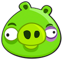

# Angry-Birds
Click-game Angry Birds
html+js+css game
4
## Installation

Just pull code to your Website

```
<head>
<link rel="stylesheet" href="style.css">
</head>
<section class="main">
        
        <section class="start-window">
            <div class="funny">
                
                
                
                
            </div>
        </section>
        <section class="game">
            <div class="life">
                <span>
                    <span class="counter">0</span> bal.
                    <span class="bal-line"></span>
                </span>
                <h2>Engry Birds</h2>
                <span class="liner-indicator">
                    <span class="timer">0</span>
                    <span class="time-line"></span>
                </span>
            </div>
        </section><section class="you-lose">
        </section><section class="you-win">
        </section>
    </section>

    <script src="script.js"></script>
```

## How to game?

Click [Play](https://kolaedr.github.io/angry-birds/)
